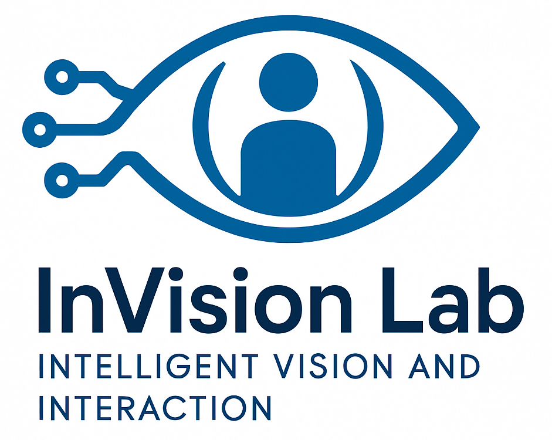
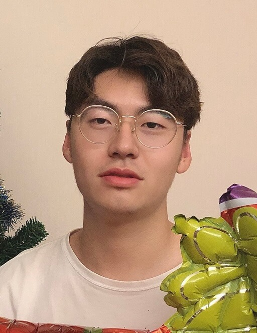
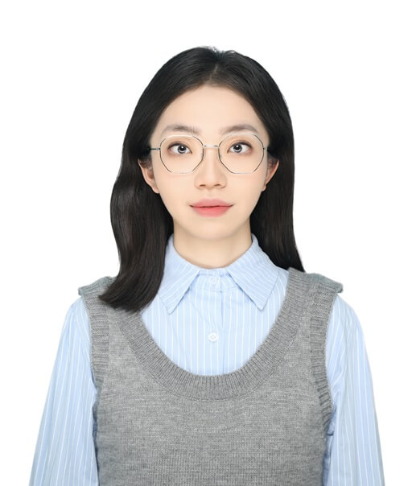
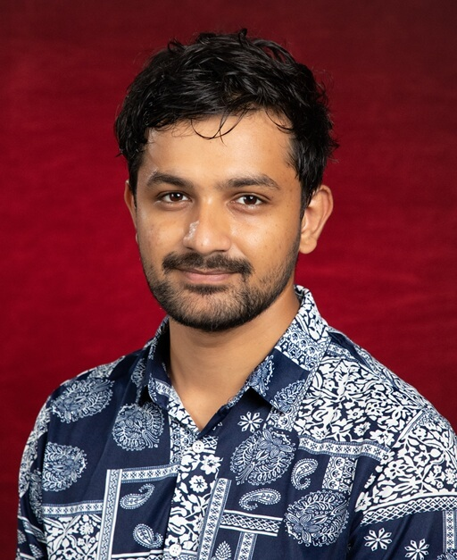
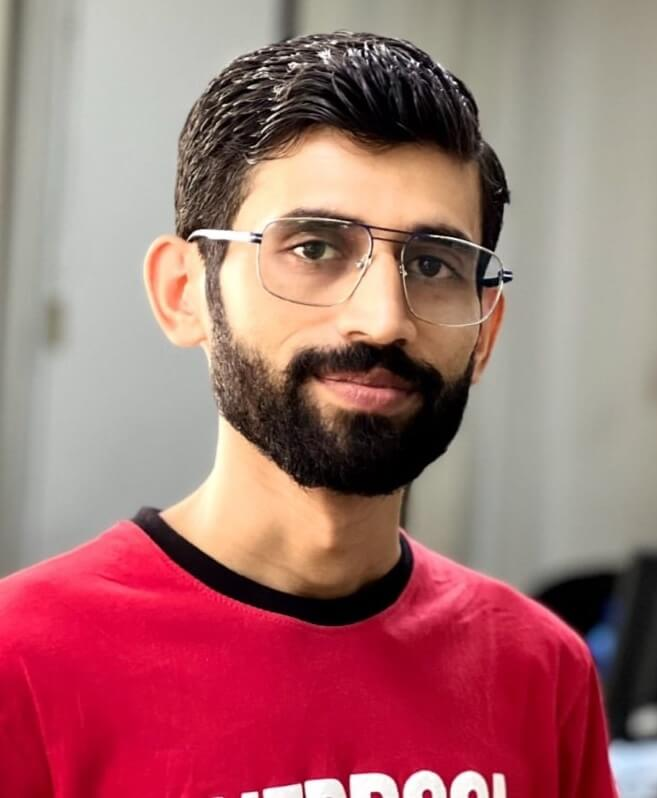
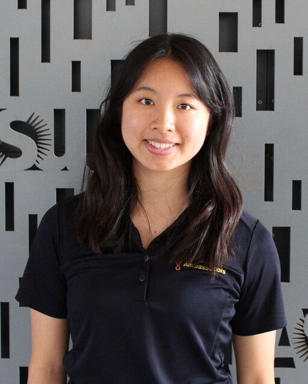
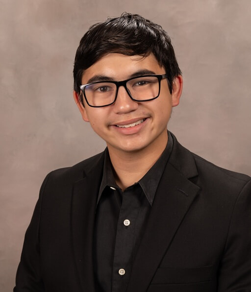
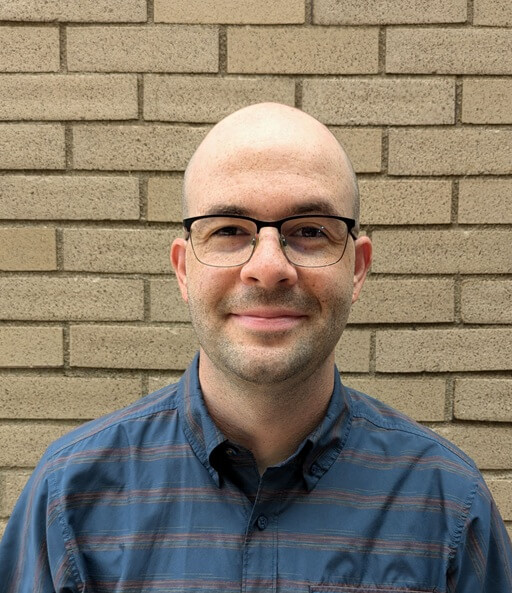

<!-- The Intelligent Vision and Interaction (InVision) Lab is led by Dr. Rui Yu. Our research vision is to advance artificial intelligence to better understand our world and augment human capabilities. To achieve this, our work bridges foundational research in visual representation and synthesis with human-centered applications, focusing on creating trustworthy AI for society and pioneering new tools for medicine and healthcare. -->

<table style="border: 1px solid transparent">
  <tr style="border: 1px solid transparent">
    <td style="border: 1px solid transparent" width="180" align="left">
      
    </td>
    <td style="border: 1px solid transparent">
      

        The Intelligent Vision and Interaction (InVision) Lab is led by Dr. Rui Yu. Our research vision is to advance artificial intelligence to better understand our world and augment human capabilities. To achieve this, our work bridges foundational research in visual representation and synthesis with human-centered applications, focusing on creating trustworthy AI for society and pioneering new tools for medicine and healthcare.
      

    </td>
  </tr>
</table>

## **Principal Investigator**

<table style="border: 1px solid transparent">
	<tr style="border: 1px solid transparent">
		<td style="border: 1px solid transparent" width="150" align="left">
			
		</td>
		<td style="border: 1px solid transparent">
			

				<a href="https://ruiyu0.github.io/"><b>Dr. Rui Yu</b></a> 
				Assistant Professor 
				CSE@UofL
			

		</td>
	</tr>
</table>

## **Current Students**

### **PhD Students**

<table style="border: 1px solid transparent">
	<tr style="border: 1px solid transparent">
		<td style="border: 1px solid transparent" width="150" align="left">
			
		</td>
		<td style="border: 1px solid transparent">
			

				<a href="https://zhangzitong1312.github.io/Homepage/"><b>Zitong Zhang</b></a> 
				CSE@UofL 
				Fall 2024 - Present
			

		</td>
	</tr>
	<tr style="border: 1px solid transparent">
		<td style="border: 1px solid transparent" width="150" align="left">
			
		</td>
		<td style="border: 1px solid transparent">
			

				<a href="https://www.linkedin.com/in/fan-zhu"><b>Fan Zhu</b></a> 
				CSE@UofL 
				Fall 2024 - Present
			

		</td>
	</tr>
	<tr style="border: 1px solid transparent">
		<td style="border: 1px solid transparent" width="150" align="left">
			
		</td>
		<td style="border: 1px solid transparent">
			

				<a href=""><b>Durude Mahee</b></a> 
				ECE@UofL (co-advised by Dr. Hongxiang Li) 
				Fall 2024 - Present
			

		</td>
	</tr>
</table>

### **Master's Students**

<table style="border: 1px solid transparent">
	<tr style="border: 1px solid transparent">
		<td style="border: 1px solid transparent" width="150" align="left">
			
		</td>
		<td style="border: 1px solid transparent">
			

				<a href="https://suranjan.com.np/"><b>Suranjan Gautam</b></a> 
				CSE@UofL 
				Fall 2024 - Present
			

		</td>
	</tr>
	<tr style="border: 1px solid transparent">
		<td style="border: 1px solid transparent" width="150" align="left">
			
		</td>
		<td style="border: 1px solid transparent">
			

				<a href="https://www.linkedin.com/in/antarip-saha/"><b>Antarip Saha</b></a> 
				CSE@UofL 
				Fall 2024 - Present
			

		</td>
	</tr>
</table>

### **Undergraduate Students**

<table style="border: 1px solid transparent">
	<tr style="border: 1px solid transparent">
		<td style="border: 1px solid transparent" width="150" align="left">
			
		</td>
		<td style="border: 1px solid transparent">
			

				<a href="https://www.linkedin.com/in/john-kellogg-10405b285/"><b>John Kellogg</b></a> 
				CSE@UofL 
				Summer 2025 - Present 
				<a href="https://engineering.louisville.edu/academics/departments/computer/reu-site-summer-research-program-computer/">NSF REU</a> student
			

		</td>
	</tr>
</table>

<!-- ### **Interns**

<table style="border: 1px solid transparent">
	<tr style="border: 1px solid transparent">
		<td style="border: 1px solid transparent" width="150" align="left">
			
		</td>
		<td style="border: 1px solid transparent">
			

				<a href=""><b>Zhipeng Yao</b></a> 
				CST@SYUCT 
				Fall 2024 - Present
			

		</td>
	</tr>
</table> -->

## **Previous Students**

### **Master's Students**

<table style="border: 1px solid transparent">
	<tr style="border: 1px solid transparent">
		<td style="border: 1px solid transparent" width="150" align="left">
			
		</td>
		<td style="border: 1px solid transparent">
			

				<a href="https://www.linkedin.com/in/meghwardayanand/"><b>Dayanand Meghwar</b></a> 
				CSE@UofL 
				Fall 2024 - Spring 2025 
				Now Software Engineer at Aquent
			

		</td>
	</tr>
</table>

### **Undergraduate Students**

<table style="border: 1px solid transparent">
	<tr style="border: 1px solid transparent">
		<td style="border: 1px solid transparent" width="150" align="left">
			
		</td>
		<td style="border: 1px solid transparent">
			

				<a href="https://www.linkedin.com/in/ashleyyang2027/"><b>Ashley Yang</b></a> 
				Arizona State University 
				Summer 2025 
				<a href="https://engineering.louisville.edu/academics/departments/computer/reu-site-summer-research-program-computer/">NSF REU</a> student
			

		</td>
	</tr>
	<tr style="border: 1px solid transparent">
		<td style="border: 1px solid transparent" width="150" align="left">
			
		</td>
		<td style="border: 1px solid transparent">
			

				<a href="https://www.linkedin.com/in/jason-farnsworth-p85r3/"><b>Jason Farnsworth</b></a> 
				Randolph College 
				Summer 2025 
				<a href="https://engineering.louisville.edu/academics/departments/computer/reu-site-summer-research-program-computer/">NSF REU</a> student
			

		</td>
	</tr>
	<tr style="border: 1px solid transparent">
		<td style="border: 1px solid transparent" width="150" align="left">
			
		</td>
		<td style="border: 1px solid transparent">
			

				<a href="www.linkedin.com/in/tyler-m-sexton"><b>Tyler Sexton</b></a> 
				CSE@UofL 
				Summer 2025 
				<a href="https://student.louisville.edu/engaged-learning/undergraduate-research/summer-research-opportunity-program-srop">UofL SROP</a> student
			

		</td>
	</tr>
	<tr style="border: 1px solid transparent">
		<td style="border: 1px solid transparent" width="150" align="left">
			
		</td>
		<td style="border: 1px solid transparent">
			

				<a href="https://www.linkedin.com/in/aiden-bosela/"><b>Aiden Bosela</b></a> 
				Morehead State University 
				Summer 2024 
				<a href="https://engineering.louisville.edu/academics/departments/computer/reu-site-summer-research-program-computer/">NSF REU</a> student
			

		</td>
	</tr>
</table>